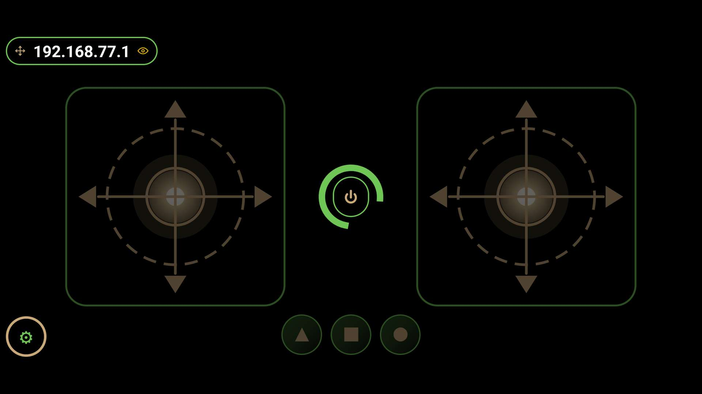

  

<h1 align="center">TRIK Gamepad (Android)</h1>

## Screenshots

   
  <em>Connected — live video, touch pads, control buttons</em>

  
  &nbsp;&nbsp;&nbsp;&nbsp;
  
  &nbsp;&nbsp;&nbsp;&nbsp;
  
   
  <em>Standby (left), app preferences (center), robot connection (right)</em>

Simple Android application that mimics a gamepad and is used to control TRIK
robots.

You can get it [here](https://play.google.com/store/apps/details?id=com.trikset.gamepad2)

## For users

Available in English, Russian, French, German and Vietnamese (follows the
system language).

On large-screen Android 16 devices (tablets, foldables, and desktop windows —
screens with the smaller side at least 600 dp), Android ignores the app's
landscape lock, so the gamepad can appear rotated or stretched. To keep the
intended layout, opt in to the app's default orientation behavior in the
system's aspect-ratio settings, or lock your device's rotation to landscape.

### Hardware gamepad button mapping

When using a physical gamepad (PS-style), the buttons map to TRIK Studio
variables as follows:

| PS button | Gamepad command | TRIK Studio variable |
|---|---|---|
| A (Cross) | `btn 1` | `gamepadButton1` |
| B (Circle) | `btn 2` | `gamepadButton2` |
| X (Square) | `btn 3` | `gamepadButton3` |
| Y (Triangle) | `btn 4` | `gamepadButton4` |
| L1 / R1 (Shoulder) | `btn 5` | `gamepadButton5` |
| Left stick / D-pad | `pad 1` | `padX[1]`, `padY[1]` |
| Right stick | `pad 2` | `padX[2]`, `padY[2]` |

Configure the number of magic buttons in Settings → App settings to match the
variables you use in your program. L1 and R1 both map to button 5 (the same
command).

## For developers

New session or contributor? Start here:

- `scripts/README.md` — reusable tooling (gate, translator, device-identifier
  scrub, APK analyzer, pixel-census, etc.).
- `.github/workflows/ci.yml` — CI configuration (build, unit tests, quality
  gates, instrumented tests on emulator).
- `app/config/` — static-analysis rule sets (detekt, checkstyle, pmd).
- `app/lint.xml` — Android Lint configuration and baseline.
- The maintained app lives in the canonical `app/` module at the repo root
  (`settings.gradle` + `app/`); all gradle commands run from the repo root.
