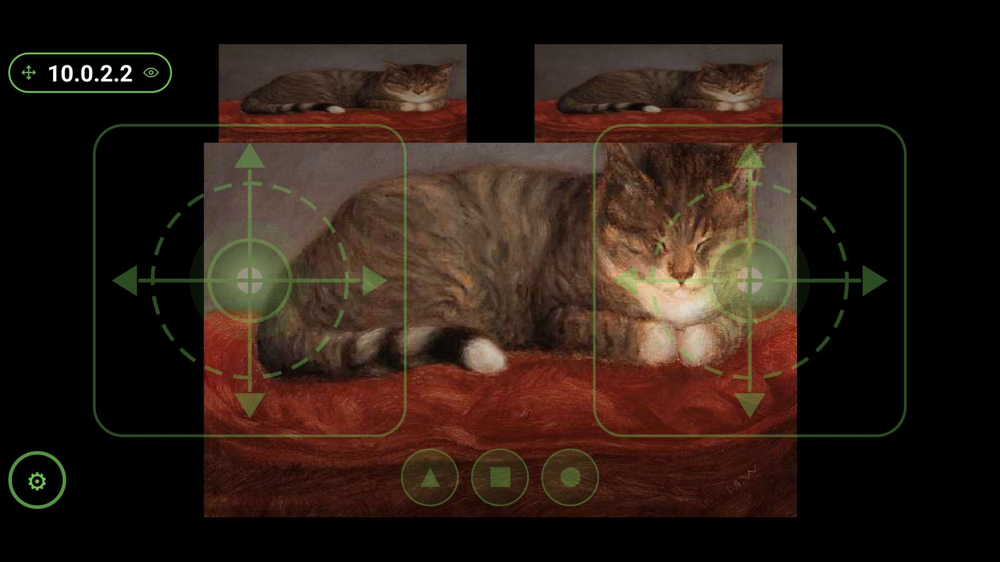
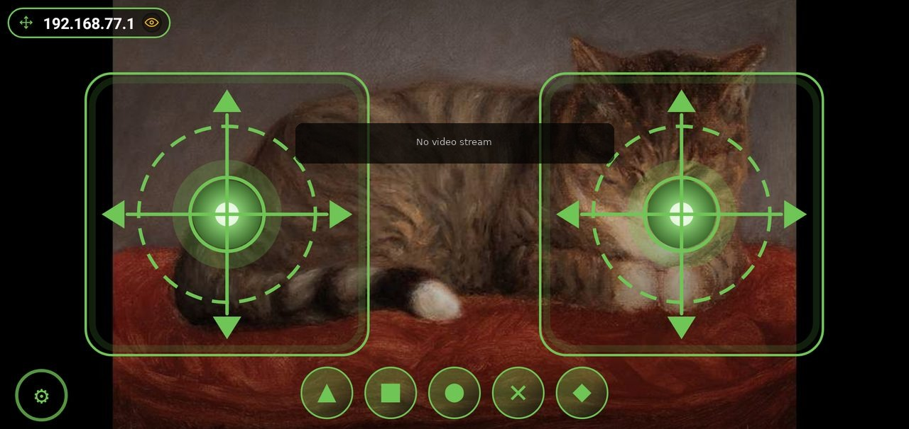

  

<h1 align="center">TRIK Gamepad (Android)</h1>

When no camera is available, the loading spinner stops after 10s and a badge
appears:

Simple Android application that mimics a gamepad and is used to control TRIK
robots.

You can get it [here](https://play.google.com/store/apps/details?id=com.trikset.gamepad2)

## For users

Available in English, Russian, French, German and Vietnamese (follows the
system language).

On large-screen Android 16 devices (tablets, foldables, and desktop windows —
screens with the smaller side at least 600 dp), Android ignores the app's
landscape lock, so the gamepad can appear rotated or stretched. To keep the
intended layout, opt in to the app's default orientation behavior in the
system's aspect-ratio settings, or lock your device's rotation to landscape.

## For developers

New session or contributor? Start here:

- `scripts/README.md` — reusable tooling (gate, translator, device-identifier
  scrub, APK analyzer, pixel-census, etc.).
- `.github/workflows/ci.yml` — CI configuration (build, unit tests, quality
  gates, instrumented tests on emulator).
- `app/config/` — static-analysis rule sets (detekt, checkstyle, pmd).
- `app/lint.xml` — Android Lint configuration and baseline.
- The maintained app lives in the canonical `app/` module at the repo root
  (`settings.gradle` + `app/`); all gradle commands run from the repo root.
