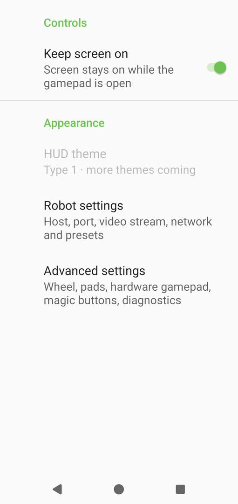
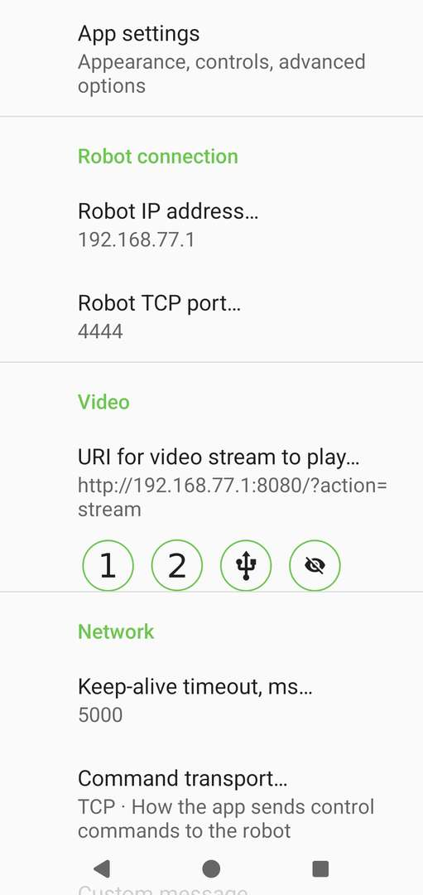

  

<h1 align="center">TRIK Gamepad (Android)</h1>

  

Simple Android application that mimics a gamepad and is used to control TRIK
robots. Connect over Wi-Fi and drive your robot with touch pads, hardware
gamepad, or phone tilt.

Available in English, Russian, French, German and Vietnamese (follows the
system language).

The app respects your privacy — it works fully offline, needs no account,
and collects no data. Read the [Privacy Policy](PRIVACY.md) for details.

On large-screen Android 16 devices (tablets, foldables, and desktop windows —
screens with the smaller side at least 600 dp), Android ignores the app's
landscape lock, so the gamepad can appear rotated or stretched. To keep the
intended layout, opt in to the app's default orientation behavior in the
system's aspect-ratio settings, or lock your device's rotation to landscape.

### Hardware gamepad button mapping

| PS button | Gamepad command | TRIK Studio variable |
|---|---|---|
| A (Cross) | `btn 1` | `gamepadButton1` |
| B (Circle) | `btn 2` | `gamepadButton2` |
| X (Square) | `btn 3` | `gamepadButton3` |
| Y (Triangle) | `btn 4` | `gamepadButton4` |
| L1 / R1 (Shoulder) | `btn 5` | `gamepadButton5` |
| Left stick / D-pad | `pad 1` | `padX[1]`, `padY[1]` |
| Right stick | `pad 2` | `padX[2]`, `padY[2]` |

## For developers

New session or contributor? Start here:

- `scripts/README.md` — reusable tooling and automation.
- `.github/workflows/ci.yml` — CI configuration and quality gates.
- `app/config/` — static-analysis rule sets (detekt, checkstyle, pmd).
- `app/lint.xml` — Android Lint configuration.
- Build: `./gradlew test lint lintDebug detekt spotbugsDebug jacocoTestReport jacocoTestCoverageVerification spotlessCheck`
